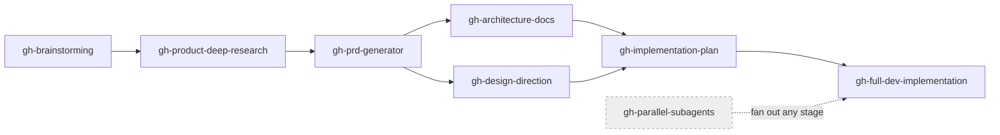

# GH AI Skills and Plugins

**Globaly Inc's internal Claude Code marketplace.** Install it once and you get every
company-authored skill — across product, research, design, and engineering — and you stay
in sync automatically as the team ships new skills.

This repo is a [Claude Code plugin marketplace](https://docs.claude.com/en/docs/claude-code/plugins).
It works the same on your laptop or any cloud box.

> **Current version:** `globaly-skills` v0.6.0 · 8 skills + the Globaly design system.

---

## Install (every team member)

```bash
# 1. Add the company marketplace (one time)
claude plugin marketplace add Globaly-Inc/GH-AI-Skills-and-Plugins

# 2. Install all company skills
claude plugin install globaly-skills@globaly
```

That's it. Restart Claude Code (or start a new session) and the skills are available.

> **Private repo:** make sure your `gh`/git auth can read `Globaly-Inc`. If `marketplace add`
> can't reach the repo, run `gh auth login` (or `gh auth status`) first.

## Staying in sync (automatic)

The plugin ships a `SessionStart` hook (`hooks/auto-sync.sh`) that, on each new session,
refreshes the marketplace and updates `globaly-skills` in the background. New skills land on
your **next** session — no action needed.

Force an update right now:

```bash
claude plugin marketplace update globaly
claude plugin update globaly-skills@globaly   # restart to apply
```

## The product pipeline

The skills chain into one idea-to-shipped-feature flow. Each stage feeds the next; invoke them in order
(or jump in wherever your work starts).



## What's inside

| Stage | Skill | Function | Use it when… |
|-------|-------|----------|--------------|
| 1 | `gh-brainstorming` | Product | adaptive brainstorming for a raw idea or fuzzy plan |
| 2 | `gh-product-deep-research` | R&D / Research | competitor analysis, product-market fit, user pain points (token-lean: single engine, capped sources) |
| 3 | `gh-prd-generator` | Product | generating a structured PRD (`docs/PRD.md`) from brainstorming + research |
| 4 | `gh-architecture-docs` | Engineering | turning a PRD into a backend spec, SQL skeleton, and migration plan |
| 4 | `gh-design-direction` | Design | frontend design direction + component plan before components are built |
| 5 | `gh-implementation-plan` | Engineering | step-by-step implementation plan gate before any code is written |
| 6 | `gh-full-dev-implementation` | Engineering | implementing a feature or improving architecture end-to-end (React + TS + Supabase) |
| — | `gh-parallel-subagents` | Engineering | fan independent tasks out to parallel subagents on separate git worktrees |

**Also included:** [`globaly-design-system/`](./globaly-design-system/) — the shared component library
(40 components, design tokens, typography), brand-aware via `data-brand`. `gh-design-direction` builds against it.

More skills are added over time — they appear automatically after a sync.

## Verify your install

```bash
claude plugin list            # globaly-skills should be listed
```

## Contributing a skill

See [CONTRIBUTING.md](./CONTRIBUTING.md). Short version: add `skills/<name>/SKILL.md`,
bump the `version` in both manifests, open a PR.

---

_Internal to Globaly Inc. Not for external distribution._
