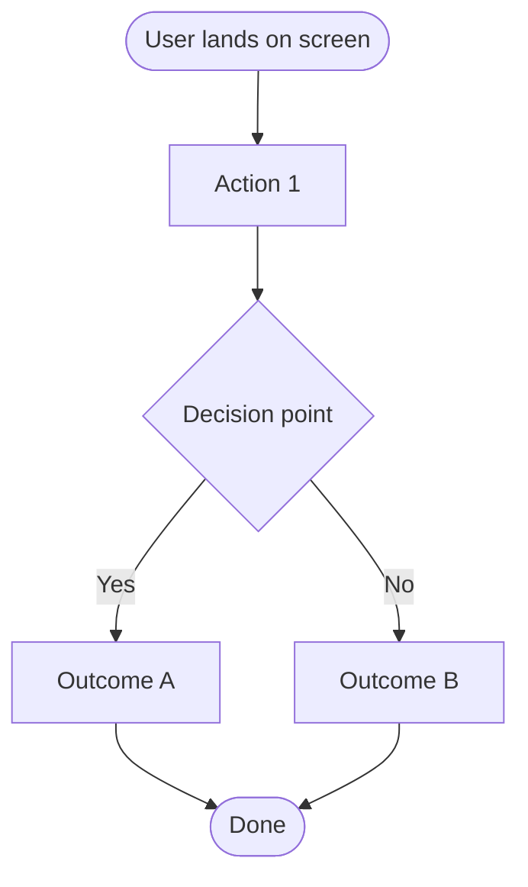
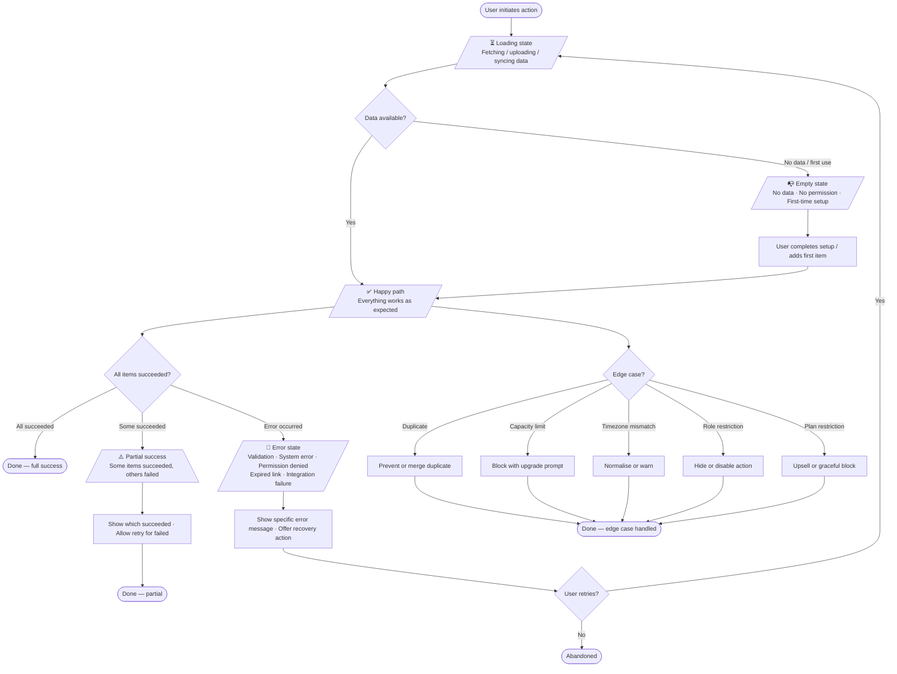

# GlobalyHub PRD Generation

Produce a production-quality PRD for any GlobalyHub project feature or initiative
(GlobalyApp, GlobalyOS, or other projects in the ecosystem).
This skill is **inputs-first**: consume prior skill outputs before asking anything.

---

## Upstream Inputs

This skill is the downstream consumer of two skills. Always check for their
outputs before exploring the codebase:

| Skill | Expected output file | What to extract |
|-------|---------------------|-----------------|
| `/brainstorming` | `docs/superpowers/specs/*-design.md` | Problem framing, personas, design decisions, approved approach |
| `/GH-Market-Research` (or equivalent) | `docs/research/*.md` or `docs/market-research.md` | Competitor landscape, market sizing, user insights, differentiation signals |

If either file is missing, mark the affected sections `🔵 Open Question` and
continue — do not block on them.

---

## Principles

- **Inputs-first, questions-last.** Mine brainstorming docs and research outputs
  before asking the user a single question.
- **Vertical slices only.** User stories cut end-to-end through ALL layers
  (schema → API → UI → acceptance test). Never horizontal slices.
- **Two-tier user flows.** Every feature gets a high-level flow. Every epic gets
  a detailed 6-state flow. Both are required — neither is optional.
- **Living document.** Tag every gap: `🔶 Assumption` (plausible, unvalidated)
  or `🔵 Open Question` (unknown, needs discovery). Never leave a blank section.
- **Project vocabulary.** Use terms from existing code, docs, and brainstorm
  outputs — not generic alternatives.

---

## Execution Steps

### Step 1 — Consume upstream outputs (silent)

Read in this order:

1. **Brainstorming output** — `docs/superpowers/specs/` (latest `-design.md`)
2. **Market research output** — `docs/research/` or `docs/market-research.md`
3. `docs/` — other existing specs, ADRs, design docs
4. `.planning/` — GSD planning artifacts if present
5. `README.md` / `CLAUDE.md` — project overview and constraints
6. Key `src/` files — current domain model, entities, feature boundaries
7. Any prior `docs/PRD.md` — established section style

Extract per-section:
- Problem framing and evidence (from brainstorming)
- Personas and JTBD (from brainstorming)
- Suggested solution options considered and chosen approach (from brainstorming)
- Competitor table and differentiators (from market research)
- Market sizing if available (from market research)
- Existing feature set, tech stack, constraints (from codebase)

### Step 2 — Draft skeleton

Draft every section with everything inferred. Mark gaps inline.
Do NOT ask the user anything yet.

### Step 3 — Gap-fill Q&A

Ask only about mandatory sections still substantially empty after Steps 1–2.
One question at a time, in template order.

Mandatory sections that must not remain as pure `🔵 Open Questions`:
- Problem Statement (specific pain + evidence)
- Suggested Solution (what approach was chosen and why)
- Solution Overview (what is being built)
- Feature-Level User Flows (at least one high-level flow)
- Epic User Flows (6-state flow for each epic)
- Success Metrics (primary metric with baseline → target)
- Scope (at least one explicit out-of-scope item)

### Step 4 — Write `docs/PRD.md`

Write the complete file. End with a one-line summary:
`Inferred from: [sources used]. Asked about: [sections that needed Q&A].`

---

## PRD Template

````markdown
# [Feature / Initiative Name] — PRD

> **Status:** Draft | **Owner:** [PM name] | **Last updated:** [date]
> **Project:** [GlobalyApp / GlobalyOS / other]
> **One-liner:** [problem] → [solution] → [expected impact]

---

## 1. Problem Statement & Hypothesis

### Problem
<!-- Who has it? What is it? Why is it painful? -->
[description]

**Evidence**
- [customer quote / analytics datum / support ticket count]

### Hypothesis
> If we [action] for [persona], then [measurable outcome], because [root cause].

---

## 2. User Personas & Jobs-to-be-Done

### Primary Persona — [Name]
| Attribute | Detail |
|-----------|--------|
| Role | |
| Tech savviness | |
| Core goal | |
| Key pain point | |

**JTBD:** When [situation], I want to [motivation], so I can [outcome].

### Secondary Persona — [Name] *(if applicable)*
[brief profile]

---

## 3. Suggested Solution

<!-- What options were considered? What was chosen and why?
     Source: brainstorming design doc. -->

### Options Considered
| Option | Summary | Pros | Cons |
|--------|---------|------|------|
| A | | | |
| B | | | |

### Chosen Approach
**[Option X]** — [one-paragraph rationale: why this over the alternatives,
what constraints drove the decision, what is deliberately deferred.]

---

## 4. Solution Overview

<!-- What are we building — from the user's perspective.
     High-level only: no pixel specs, no file paths. -->

[2–3 paragraphs]

**Key capabilities:**
- [capability 1]
- [capability 2]

---

## 5. Competitor Analysis

<!-- Source: market research output. -->

| Competitor | How they solve it | Our differentiator |
|------------|-------------------|--------------------|
| [name] | [approach] | [why ours is better/different] |

---

## 6. Feature-Level User Flows

<!-- One high-level flow per feature. Shows the main path through the
     feature without branching into every state. Use Mermaid flowchart. -->

### Feature: [Feature Name]



*(Repeat for each feature in this initiative.)*

---

## 7. Epics, User Stories & Acceptance Criteria

<!-- Each epic block contains: Epic Hypothesis → Detailed 6-State User Flow
     → User Stories with AC. -->

---

### Epic 1 — [Epic Name]

#### Epic Hypothesis
> We believe that [building X] for [persona] will [outcome] because [reason].
> We'll validate by measuring [metric] within [timeframe].

#### Epic User Flow

<!-- Detailed flowchart covering all 6 states for this epic. -->



**State inventory for this epic:**

| State | Trigger | Expected behaviour |
|-------|---------|-------------------|
| Happy path | Normal data, correct permissions | [describe] |
| Empty state | No data / no permission / first use | [describe] |
| Loading state | Data fetch / upload / import / sync / processing | [describe] |
| Error state | Validation / system / permission / expired / integration | [describe] |
| Partial success | Some items pass, some fail | [describe] |
| Edge cases | Duplicates / capacity / timezone / role / plan limits | [describe] |

#### Stories

Stories follow vertical-slice rules — each cuts end-to-end and is demoable alone.
Use INVEST (Independent · Negotiable · Valuable · Estimable · Small · Testable).

**Story 1 — [Title]** `P0 / P1 / P2`
```
As a [persona],
I want to [action],
so that [outcome].
```
**Acceptance Criteria:**
- **Given** [precondition] **When** [action] **Then** [result]
- **Given** [empty state trigger] **When** [user lands] **Then** [empty state shown]
- **Given** [loading trigger] **When** [operation starts] **Then** [loading indicator shown]
- **Given** [error condition] **When** [operation fails] **Then** [specific error + recovery shown]

*(Repeat Story block. Use `/epic-breakdown-advisor` to split stories > 5 days.)*

---

*(Repeat Epic block for each epic in this initiative.)*

---

## 8. Success Metrics & KPIs

| Metric | Type | Baseline | Target | Timeframe |
|--------|------|----------|--------|-----------|
| [primary metric] | Leading | | | 30 days post-launch |
| [secondary metric] | Lagging | | | 90 days post-launch |

**Guardrail metrics** (must not regress):
- [metric]: maintain ≥ [current value]

---

## 9. Scope & Out-of-Scope

### In Scope
- [item]

### Out of Scope
- [item] — [one-line rationale]

### Future Consideration
- [item deliberately deferred]

---

## 10. Dependencies & Risks

| Item | Type | Owner | Mitigation |
|------|------|-------|------------|
| [dependency] | Technical / External | | |
| [risk] | | | |

---

## 11. Open Questions

| Question | Owner | Due |
|----------|-------|-----|
| [question] | [PM / Eng / Design] | [date] |

---

## Appendix

- Brainstorming doc: [link]
- Market research: [link]
- Design files: [link]
- Related ADRs: [link]
````

---

## User Flow Rules

### Feature-level (§6) — high-level only
- One diagram per feature
- Shows the main path: entry → key decision → outcomes
- No branching into loading/error/edge states
- Goal: anyone can understand the feature in 30 seconds

### Epic-level (§7) — full 6-state coverage
Every epic flow MUST cover all six states. None are optional:

| State | What triggers it | What must be shown |
|-------|-----------------|-------------------|
| **Happy path** | Everything works | End-to-end success sequence |
| **Empty state** | No data · No permission · No setup · First-time use | Contextual empty UI + action to fill it |
| **Loading state** | Data fetch · Upload · Import · Sync · Processing | Progress indicator + cancel if > 3s |
| **Error state** | Validation error · System error · Permission denied · Expired link · Integration failure | Specific message + recovery action |
| **Partial success** | Some items succeed, some fail | Which succeeded · Which failed · Retry option |
| **Edge cases** | Duplicates · Capacity limits · Timezone · Role restrictions · Plan restrictions | Graceful block or merge, never silent failure |

---

## Anti-Patterns

| What to avoid | Why | Fix |
|---------------|-----|-----|
| Skipping brainstorming/research inputs | Duplicates work already done | Always check upstream docs in Step 1 |
| Happy-path-only user flow | Ships broken empty/error states | Every epic flow requires all 6 states |
| One user flow for the whole PRD | Epic-specific behaviour gets lost | Feature-level flow + per-epic detailed flow |
| Horizontal user stories | Delivers no standalone user value | Rewrite as thin end-to-end slice |
| Solution section specifying exact UI | Removes design collaboration | Keep it behavioural, not visual |
| Metrics without targets | Can't validate success | Always pair metric with baseline → target |
| Out-of-scope section missing | Causes scope creep | List at least 3 explicit exclusions |

---

## Related Skills

- `/GH-brainstorming` — Required upstream: explore and design before PRD
- `/GH-Market-Research` — Required upstream: competitor and user research
- `/epic-breakdown-advisor` — Split large epics using 9 Humanizing Work patterns
- `/user-story` — Write and validate individual user stories
- `/product-discovery` — Validate an idea before brainstorming
- `/gsd-plan-phase` — Turn a finished PRD into an executable GSD plan
