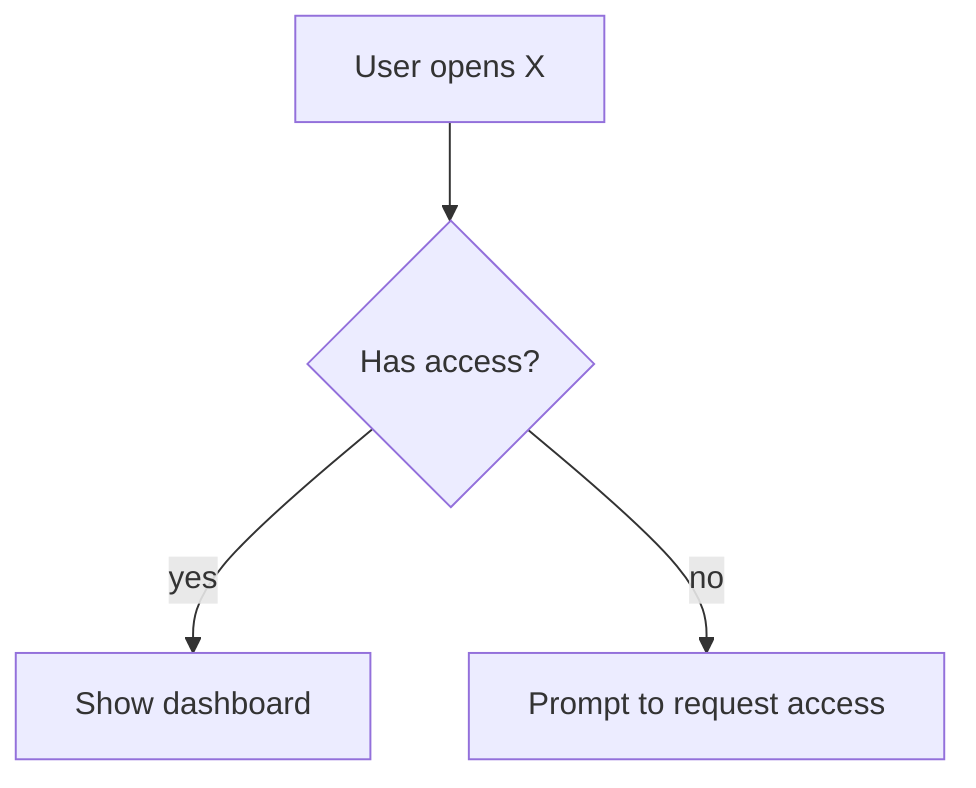
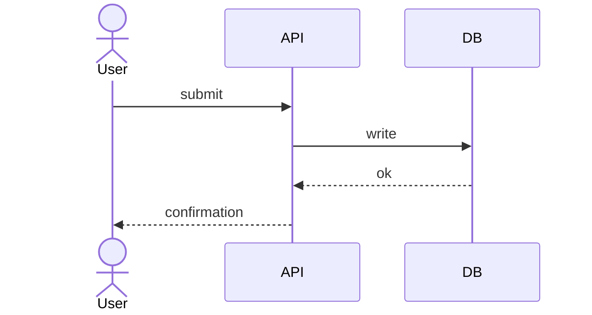
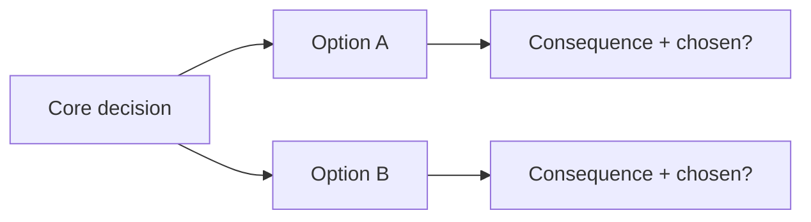
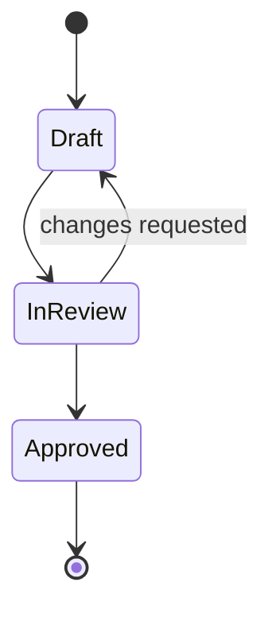

# Output Doc Template

The deliverable is one decision-complete design doc in markdown. Zero placeholders, zero contradictions.
Include Mermaid diagrams **only where a picture is genuinely clearer than prose** (just-in-time).

## Structure

```markdown
# <Topic> — Design

> Status: Draft for review · Date: YYYY-MM-DD · Stage: <raw idea | fuzzy plan | near-final> · Tone: <Startup | Builder> · Scope mode: <one of the four>

## 1. Problem
<One sentence: "<user> struggles to <job> because <obstacle>." Then the evidence — real behavior, the
status-quo workaround and its cost. Name one specific person/role.>

## 2. Outcome & dream state
<What the user can do after this ships. Where this should be in 12 months.>

## 3. Scope decision
<The committed mode and exactly what is in / out. List opt-in expansions accepted or deferred.>

## 4. Approach
<The chosen approach and why, with the 2–3 alternatives considered and their tradeoffs in a table.>

## 5. Design
<Section-by-section design. Decisions labeled one-way vs two-way door. Diagrams where they add clarity.>

## 6. Failure modes & edge cases   (zero-silent-failures)
<Named failure handlers. Data-flow shadow paths: nil / empty / error. Edge cases: double-click,
navigate-away, stale state, slow connection, partial failure.>

## 7. Open questions / risks
<Anything genuinely unresolved, ranked by impact × uncertainty. If empty, say "none — all branches resolved.">

## 8. Decision log
<Each significant decision: what was decided, the rationale, reversibility. This is what gets saved to memory.>
```

## Diagram patterns (Mermaid)

Use the simplest type that communicates the point.

**Flowchart** — process / user flow:
````

````

**Sequence** — interaction between components/services:
````

````

**Decision tree** — the resolved branches from Phase 3:
````

````

**State diagram** — entity lifecycle:
````

````

## Quality bar (self-review checklist)

- [ ] Problem stated in one sentence with real evidence and a named person.
- [ ] Scope mode committed; in/out explicit.
- [ ] Alternatives table present with a clear recommendation.
- [ ] Every significant decision labeled one-way / two-way door.
- [ ] Failure modes and edge cases named (no silent failures).
- [ ] No placeholders, no "TBD", no contradictions.
- [ ] Diagrams only where they add clarity, and they render (valid Mermaid).
- [ ] Decision log filled in and ready to save to claude-mem.
