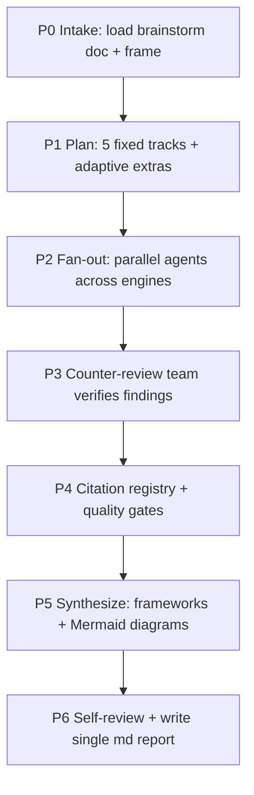

# GH-Deep-Research

A disciplined, multi-engine product-research pipeline. It takes a finished **brainstorming doc** and turns it
into one consolidated, evidence-backed market+competitor report: where the product fits, who the competitors
are, where they're weak (from real users), and which category to play in.

This is **research, not strategy execution.** It gathers and verifies evidence and presents implications.
It does not write code, PRDs, or plans.

## Pipeline (P0 → P6)

## P0 — Intake & frame

1. **Ask the user for the brainstorm doc path.** Always ask (don't auto-pick). Read it fully.
   Extract: the problem, target user, the proposed product/wedge, and the dream state. These seed every track.
2. Set **AS_OF = today's actual date** (from context, never from memory). All recency judgments use it.
3. Confirm engine availability (see `references/engines-and-mcps.md`). State which engines are live; degrade
   gracefully if any are missing (note it in the report, lower confidence — never fake a source).
4. Restate the research question in one line and the scope (geography, time horizon, segment) before running.

## P1 — Plan the tracks

Run the **5 fixed product tracks**, plus **1–2 adaptive extra tracks** if the brainstorm doc surfaces a
unique angle (e.g. a regulated niche, a specific channel). Full track specs + per-track sub-questions and
engine routing in **`references/research-tracks.md`**:

1. **Market & PMF signals** — size (TAM/SAM/SOM), demand evidence, willingness to pay.
2. **Competitor landscape** — who exists, features, pricing, positioning.
3. **Competitor weaknesses** — mined from **user reviews, Reddit, forums, app-store/G2/Trustpilot** complaints.
4. **Category fit** — does this slot into an existing category or warrant a new one (category design)?
5. **Trends, future-fit & regulatory** — where the market is heading; what could constrain it.

## P2 — Parallel fan-out across engines

Dispatch tracks **concurrently** across the selected engines (see `references/engines-and-mcps.md`):

- **Claude subagents (Task tool)** — orchestration backbone; one subagent per track. Each searches, reads
  full sources, and returns **distilled structured notes only** (not raw search dumps) to keep context lean.
- **exa + firecrawl MCPs** — broad multi-source search + scraping competitor sites, Reddit, and review pages
  (the weakness-mining track leans hard on these).
- **Gemini Deep Research API** — offload 1–2 heavy tracks to a *different model* for cross-model diversity.
  **PAID (~$2–5, minutes each):** free engines run automatically, but **before any Gemini call, show an
  estimated cost + which track(s) it covers and get explicit go-ahead.** If declined/unavailable, cover that
  track with Claude+MCPs and note it.

Each agent records evidence in the log shape from `references/verification.md` (claim · source · type · date
· supports · limitation · confidence).

## P3 — Counter-review team (verification)

Before any finding enters the report, run dedicated verifier agents **in parallel**:

- **claim-validator** — is each central claim actually supported by its cited source?
- **source-diversity-checker** — are claims resting on independent sources, not one echoed secondary article?
- **recency-validator** — are dated/versioned claims current as of AS_OF?
- **contradiction-finder** — surface conflicts between sources; flag unresolved disputes.

Findings that fail verification are dropped or downgraded. Detail in **`references/verification.md`**.

## P4 — Citation registry & quality gates

Build a unified **citation registry**: dedupe sources, assign `[n]` numbers, tag type (official / review /
forum / journalism / analysis) and date. Apply quality gates: central claims need a primary/strong source;
review-derived weaknesses need ≥3 independent user mentions before stated as a pattern (never launder one
complaint into a trend). List dropped sources with the reason.

## P5 — Synthesize with frameworks

Apply all four frameworks (how-to in **`references/frameworks.md`**), using **Mermaid diagrams just-in-time**
(only where a picture beats prose):

- **Competitor matrix + weaknesses** — feature/pricing table + synthesized, citation-backed weakness list.
- **Positioning / perceptual map** — 2-axis map of competitors and where GlobalyHub lands.
- **Market sizing** — TAM/SAM/SOM, top-down + bottom-up, assumptions stated.
- **Category fit + Five Forces** — existing vs new category recommendation + industry attractiveness.

Lead with conclusions, then evidence. Explain disagreement; don't flatten it. Mark confidence per section.

## P6 — Self-review & write the report

1. **Self-review** against the checklist in `references/report-template.md` (every central claim cited near
   the claim, dates present, contradictions visible, no placeholders, diagrams valid).
2. **Ask where to save**, then write **one consolidated markdown report** using the template. Single md file —
   no JSON sidecar, no separate per-track files.
3. Save the key conclusions + decision-relevant facts to **claude-mem** so later work compounds.

Then stop. The deliverable is the report.

## Guardrails

- ❌ Never answer competitor/market questions from memory after activating — gather fresh evidence.
- ❌ No hallucinated URLs; never resurrect a dropped source; never imply an unread source was read.
- ❌ No review-mined "pattern" from a single complaint (≥3 independent mentions).
- ✅ Citations sit next to the claims they support, not only in a final list.
- ✅ Disclose access limits (paywalls, blocked pages, skipped paid engine) and lower confidence accordingly.
- Keep the run proportional: a narrow product gets a tight report; a broad/contested market gets the full treatment.
