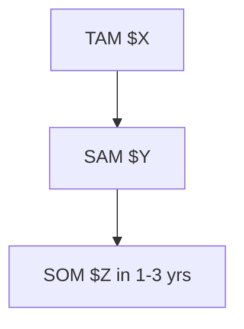

# Analytical Frameworks

Apply all four. Each must be **evidence-backed** (cite sources) and use a **Mermaid diagram only where it
beats prose**. State assumptions explicitly; mark confidence.

---

## 1. Competitor matrix + weaknesses
A comparison table across direct + indirect competitors and the status-quo workaround:

```markdown
| Competitor | Segment | Key features | Pricing | Positioning | Top user-reported weaknesses [n] |
|---|---|---|---|---|---|
```

Below the table, a **synthesized weakness list** — each weakness with the number of independent user mentions
and 1–2 representative verbatim quotes (cited). These weaknesses are the wedge: they're where GlobalyHub can win.

## 2. Positioning / perceptual map
Pick the two axes that matter most to buyers (e.g. price vs. depth, generalist vs. specialist, manual vs.
AI-native). Plot competitors and where GlobalyHub's product would land — aim for an empty, valuable quadrant.

```mermaid
quadrantChart
  title Positioning map
  x-axis Low price --> High price
  y-axis Shallow --> AI-native depth
  quadrant-1 Premium depth
  quadrant-2 Overpriced
  quadrant-3 Commodity
  quadrant-4 Value play
  Competitor A: [0.3, 0.4]
  Competitor B: [0.7, 0.6]
  GlobalyHub (proposed): [0.45, 0.8]
```
(If `quadrantChart` doesn't render in the target viewer, fall back to a labeled 2x2 described in prose.)

## 3. Market sizing (TAM / SAM / SOM)
- **TAM** (top-down): total market from analyst/industry data [cite].
- **SAM**: the slice the product can realistically serve (segment × geography).
- **SOM**: obtainable in 1–3 years given GTM (bottom-up: # target accounts × ACV).
- Show **both** top-down and bottom-up and reconcile them; state every assumption.



## 4. Category fit + Five Forces
**Category decision:** existing category (compete on execution) vs. new category (category design). Recommend
one, with the evidence. If new: give the category name and the "from → to" narrative.

**Porter's Five Forces** on the chosen arena (rate each Low/Med/High with a one-line justification + cite):
- Competitive rivalry · Threat of new entrants · Buyer power · Supplier power · Threat of substitutes.
Conclude with overall industry attractiveness and what it implies for entry.

---

## Synthesis rule
Tie the four together into a single **"How GlobalyHub fits"** verdict: the wedge (from competitor weaknesses),
the category play, the reachable market, and the top risks — each line traceable to cited findings.
