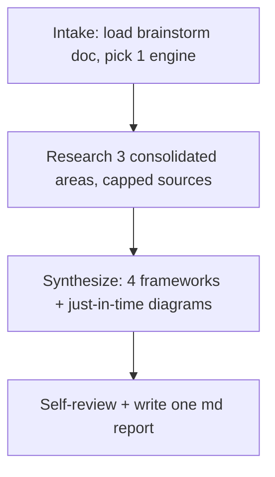

# GH-Product-Deep-Research

Takes a finished **brainstorming doc** and produces one consolidated, cited market+competitor report: where
the product fits, who the competitors are, where they're weak (from real users), and which category to play
in. This is **research, not strategy execution** — no code, PRDs, or plans.

**Token-lean by design:** one search engine, capped sources, no paid external APIs, no extra verifier agents.
Do the research directly; only spawn a subagent if a single area is genuinely too large for one pass.

## Pipeline

## P0 — Intake
1. **Ask for the brainstorm doc path** (always ask; don't auto-pick). Read it; extract the problem, target
   user, proposed wedge, and dream state — these frame the research.
2. Set **AS_OF = today's actual date** (from context, never memory). All recency judgments use it.
3. **Pick ONE search engine**: exa or firecrawl, whichever is available (load via ToolSearch). If neither,
   use built-in web search and note reduced coverage. Do **not** run both.
4. Restate the research question + scope (geography, segment, time horizon) in one line before starting.

## P1 — Research 3 consolidated areas
Cover these three areas (details + per-area sub-questions in `references/research-areas.md`). Default to doing
them yourself sequentially; cap **≤6 high-quality sources per area** and capture distilled notes (claim ·
source · date · confidence), not raw dumps.

1. **Market & Category** — size (TAM/SAM/SOM), demand signals, willingness to pay, existing-vs-new category, key trends/regulatory constraints.
2. **Competitors** — who exists (direct + indirect + status quo), features, pricing, positioning.
3. **Voice-of-Customer weaknesses** — competitor weaknesses mined from user reviews/Reddit/G2/forums. A weakness is a "pattern" only with **≥3 independent mentions**; otherwise label it anecdotal.

## P2 — Synthesize with frameworks
Apply the four frameworks (how-to + report structure in `references/report-template.md`), with **Mermaid
diagrams just-in-time** (only where a picture beats prose): competitor matrix + weaknesses · positioning map ·
TAM/SAM/SOM · category fit + Five Forces. Lead with conclusions; mark confidence per section; show
disagreement rather than flattening it.

## P3 — Self-review & write
1. **Single self-review pass** against the checklist in `references/report-template.md`: every central claim
   cited inline, dates present, weaknesses meet the ≥3-mention bar, no placeholders, diagrams valid.
2. **Ask where to save**, defaulting to `docs/research/YYYY-MM-DD-<topic>-research.md` (version-controlled,
   discoverable by `gh-prd-generator`), then write **one consolidated markdown report** (single file — no
   sidecar).
3. Save key conclusions to **claude-mem** so later work compounds. Then stop.

## Guardrails
- ❌ Never answer from memory after activating — gather fresh evidence (within the source cap).
- ❌ No hallucinated URLs; never imply an unread source was read.
- ❌ No paid research APIs; no second search engine; no separate verifier agents.
- ✅ Citations sit next to the claims they support, not only in a final list.
- ✅ Disclose access limits (paywalls, blocked pages) and lower confidence accordingly.
- Keep it proportional: a narrow product gets a tight brief; cap sources regardless.

> Need the heavyweight multi-engine version (parallel agents across Claude + exa + firecrawl + Gemini, with a
> counter-review team)? That was removed to keep this skill token-lean. Use `gh-parallel-subagents` to fan out
> if you truly need it.
